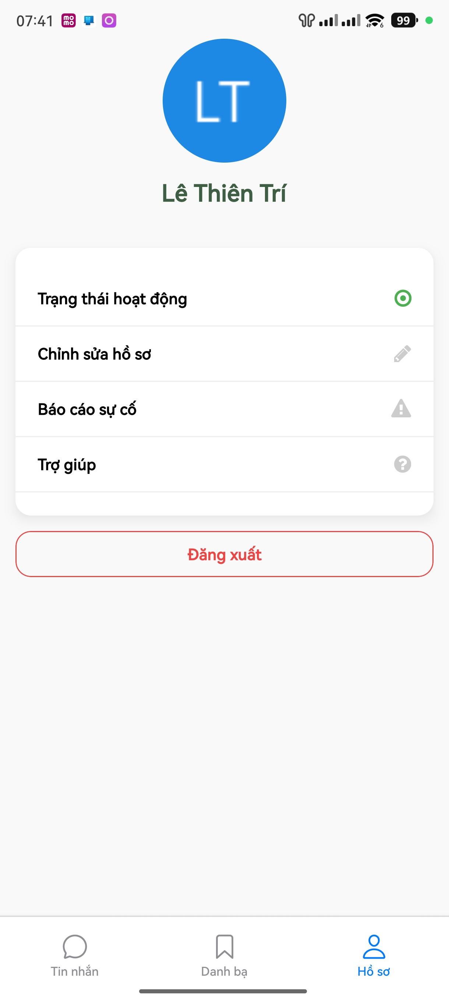
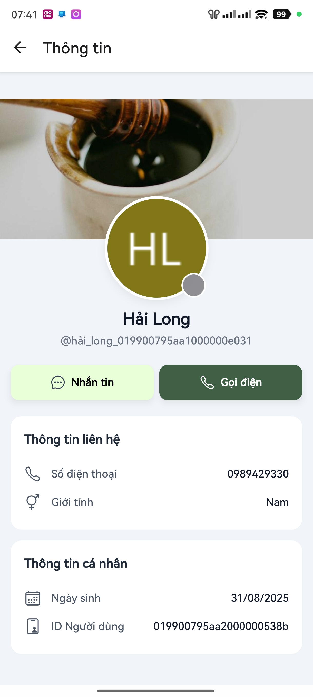
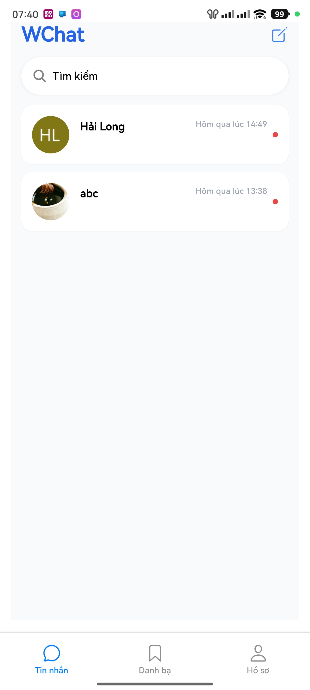
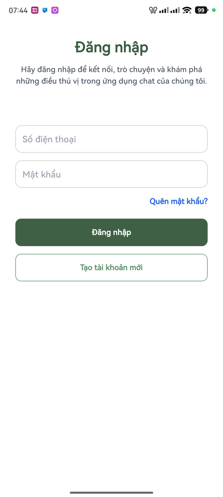
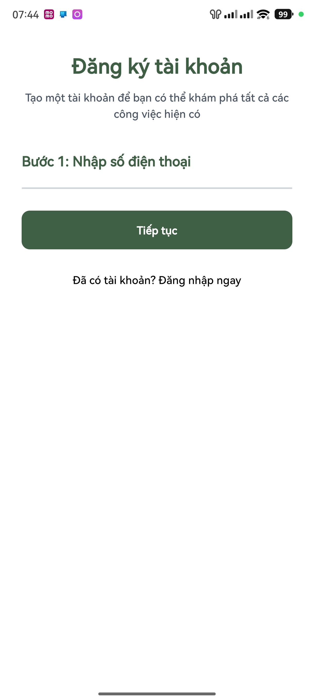

# App Chat - React Native Expo Project

Ứng dụng chat đa nền tảng xây dựng với React Native, Expo, Redux Toolkit, Firebase, Socket.io và NativeWind (Tailwind CSS cho React Native).

## 📱 Demo Ứng dụng

### Màn hình Profile & Thông tin cá nhân
<div align="center">
  
  
</div>

*Hiển thị thông tin cá nhân với avatar, trạng thái hoạt động, và các tùy chọn cài đặt*

### Màn hình Chat & Tin nhắn
<div align="center">
  
  
</div>

*Giao diện chat với tin nhắn thời gian thực, emoji reactions và các tùy chọn tương tác*

### Xác thực & Đăng ký
<div align="center">
  
  
</div>

*Màn hình đăng nhập và đăng ký tài khoản mới*

> **Lưu ý**: Screenshots được lưu tại thư mục `docs/screenshots/`. Bạn có thể copy các file ảnh từ thiết bị của mình vào đây để hiển thị demo app.

## 🔥 Tính năng nổi bật

### 💬 **Chat Features**
- **Tin nhắn thời gian thực**: Socket.io với latency thấp
- **Message Modal**: Long press để hiện emoji reactions và 12 action buttons
- **Emoji Reactions**: 6 emoji phổ biến (👍😍😂😮😢😡)  
- **Copy tin nhắn**: Clipboard integration với error handling
- **Reply & Forward**: Trả lời và chuyển tiếp tin nhắn
- **Message Actions**: Pin, Reminder, Quick Message, Translate, Read Aloud

### 🔐 **Authentication**
- **Firebase Auth**: Đăng ký/đăng nhập an toàn
- **Session Persist**: Lưu trạng thái đăng nhập với Redux-persist  
- **Auto Login**: Tự động đăng nhập khi mở app

### 🎨 **UI/UX**
- **NativeWind**: Tailwind CSS cho React Native
- **Responsive Design**: Tối ưu cho mọi kích thước màn hình
- **Dark/Light Theme**: Hỗ trợ theme động
- **Smooth Animations**: React Native Reanimated

### 🔔 **Notifications**  
- **Firebase FCM**: Push notifications
- **Real-time Updates**: Thông báo tin nhắn mới
- **Badge Counter**: Đếm tin nhắn chưa đọc


## 📁 Cấu trúc dự án

```
app-chat/
├── src/
│   ├── components/   # Các UI component tái sử dụng (Input, Avatar, ...)
│   ├── core/         # Firebase, socket, permissions, ...
│   ├── features/     # Redux slices: auth, counter, contact, ...
│   ├── hooks/        # Custom hooks
│   ├── navigation/   # AppNavigator, TabNavigator, RootNavigation
│   ├── routers/      # Định nghĩa route cho navigation
│   ├── screens/      # Các màn hình chính, pages, messages
│   ├── services/     # API service, notification service
│   ├── store/        # Redux store, middleware, persist config
│   ├── styles/       # Style file cho từng màn hình/component
│   ├── types/        # Định nghĩa type, interface chung
│   └── utils/        # Tiện ích, helper (handleNotify, ...)
├── assets/           # Hình ảnh, icon, svg
├── App.tsx           # Entry point
├── global.css        # Global style
├── package.json      # Thông tin package, scripts
├── tailwind.config.js# Cấu hình Tailwind
└── ...
```

yarn install

## 🛠️ Cài đặt & Build native

### Yêu cầu hệ thống
- Node.js >= 16
- npm hoặc yarn
- Android Studio (Android), Xcode (iOS/macOS)
- Expo CLI (chỉ để prebuild, không dùng expo start)

### Cài đặt dependencies
```bash
git clone <repository-url>
cd app-chat
npm install
# hoặc
yarn install
```

### Build & chạy native (không dùng expo start/web)
```bash
# Prebuild native code (Android)
npx expo prebuild --platform android

# Build và cài app Android
cd android
./gradlew --stop         # Dừng daemon nếu có
./gradlew clean          # Xoá build cũ
./gradlew assembleDebug  # Build debug APK
./gradlew installDebug   # Cài app lên thiết bị/emulator

# (Tuỳ chọn) Mở app trên thiết bị/emulator Android
adb shell am start -n <package_name>/<activity_name>

# Xóa cache Metro bundler (nếu cần reload JS)
npx expo start --clear
# Reset node_modules (nếu gặp lỗi lạ)
rm -rf node_modules package-lock.json
npm install
```

### Build iOS (chỉ trên macOS, nếu cần)
```bash
npx expo prebuild --platform ios
cd ios
xcodebuild clean
# Mở Xcode để build/run thủ công hoặc dùng lệnh xcodebuild
```


### Thêm màn hình mới
1. Tạo file mới trong `src/screens/` (ví dụ: `NewScreen.tsx`)
2. Thêm route vào `src/routers/index.router.ts`
3. Nếu là tab, thêm vào `tab.router.ts`
4. Định nghĩa type cho navigation nếu cần ở `src/types/navigator.ts`

### Thêm feature mới (Redux slice)
1. Tạo thư mục mới trong `src/features/` (ví dụ: `chat/`)
2. Tạo các file: `chat.reducer.ts`, `chat.action.ts`, ...
3. Thêm reducer vào `src/store/index.ts`


### Sử dụng API service
```typescript
import { apiService } from '@/services/api.service';
// GET
const data = await apiService.get('/users');
// POST
const result = await apiService.post('/users', { name: 'John' });
```


### Sử dụng notification
Notification được xử lý qua Firebase Cloud Messaging và notifee. Xem `src/core/firebase.ts` và `src/services/notification.service.ts`.

### Sử dụng socket
Socket.io client được khởi tạo ở `src/core/socketIo.ts` và tích hợp vào App qua middleware.

### Message Modal & Interactions
App có hệ thống modal tương tác tin nhắn tương tự WhatsApp/Telegram:

```typescript
// Trong MessageRow.tsx - Long press để mở modal
<TouchableOpacity 
  onLongPress={() => setShowModal(true)}
  // ...
>
  {/* Tin nhắn */}
</TouchableOpacity>

// MessageModelEvent.tsx - Modal với emoji và actions
const EMOJI_REACTIONS = ['👍', '😍', '😂', '😮', '😢', '😡'];
const ACTION_BUTTONS = [
  { id: 'reply', name: 'Trả lời', icon: 'arrow-undo' },
  { id: 'forward', name: 'Chuyển tiếp', icon: 'arrow-forward' },
  { id: 'copy', name: 'Sao chép', icon: 'copy' },
  // ... 9 actions khác
];
```

**Tính năng Modal:**
- 6 emoji reactions phổ biến  
- 12 action buttons (Reply, Forward, Copy, Pin, Reminder, v.v.)
- Copy tin nhắn vào clipboard với error handling
- Đóng modal khi tap outside
- Animation mượt mà với React Native


## 🔍 Troubleshooting

1. **Không build được Android/iOS:**
   - Chạy `npx expo prebuild --platform android` hoặc `ios` để sync native code
   - Xóa cache: `npx expo start --clear`
   - Xóa node_modules: `rm -rf node_modules package-lock.json && npm install`
2. **Không nhận được notification:**
   - Kiểm tra quyền notification, GoogleService-Info.plist, google-services.json
   - Kiểm tra cấu hình Firebase
3. **NativeWind không hoạt động:**
   - Kiểm tra `tailwind.config.js`, `babel.config.js`, import `global.css`


## 📝 Quy tắc code

- Sử dụng TypeScript cho toàn bộ codebase
- Ưu tiên NativeWind (Tailwind CSS) cho layout, spacing, flex, căn chỉnh
- Đặt tên file theo PascalCase cho component, camelCase cho biến/hàm
- Sử dụng absolute imports với alias `@/`
- Tách biệt rõ các layer: UI, logic, API, store


## 📄 License

Dự án này được phân phối dưới giấy phép MIT. Xem `LICENSE` để biết thêm thông tin.

## 👥 Tác giả

- **Hải Long** - *Main* - [GitHub](https://github.com/holha289)
- **Thiên Tri** - *...* - [GitHub](https://github.com/thientrile)

---
**Lưu ý**: Đây là dự án học tập về lập trình đa nền tảng với React Native và Expo.
